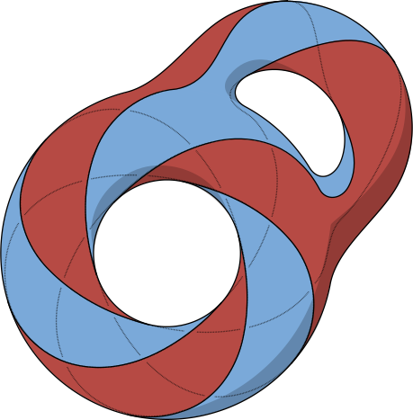

# Gabriel Chaix - Portfolio



Welcome to Gabriel Chaix's portfolio! This personal website showcases my skills, projects, experience, and more. Built with [Next.js](https://nextjs.org/) and styled using [Tailwind CSS](https://tailwindcss.com/), this portfolio is optimized for performance, accessibility, and responsiveness.

## Table of Contents

- [Features](#features)
- [Demo](#demo)
- [Technologies](#technologies)
- [Installation](#installation)
  - [Prerequisites](#prerequisites)
  - [Clone the Repository](#clone-the-repository)
  - [Environment Variables](#environment-variables)
  - [Using Docker](#using-docker)
  - [Using Docker Compose](#using-docker-compose)
  - [Running Locally](#running-locally)
- [Scripts](#scripts)
- [Deployment](#deployment)
- [Contributing](#contributing)
- [License](#license)
- [Contact](#contact)

## Features

- **Responsive Design**: Optimized for desktops, tablets, and mobile devices.
- **Dynamic Routing**: Blog section with dynamic routes.
- **Contact Form**: Send messages directly from the website.
- **Interactive Map**: Displaying my location using Leaflet.
- **Project Showcase**: Displaying past projects with detailed descriptions.
- **Dark Mode**: Toggle between light and dark themes.

## Demo

[Visit the Live Demo](https://your-portfolio-domain.com)

## Technologies

- [Next.js](https://nextjs.org/)
- [React](https://reactjs.org/)
- [Tailwind CSS](https://tailwindcss.com/)
- [Docker](https://www.docker.com/)
- [Node.js](https://nodejs.org/)
- [Leaflet](https://leafletjs.com/)
- [Swiper.js](https://swiperjs.com/)

## Installation

### Prerequisites

- [Node.js](https://nodejs.org/) (v14 or later)
- [Docker](https://www.docker.com/) (optional, for containerization)
- [Git](https://git-scm.com/)

### Clone the Repository

```bash
git clone https://github.com/your-username/my-portfolio.git
cd my-portfolio
```

### Environment Variables

Create a `.env.local` file in the root directory and add the following environment variables:

```env
# .env.local

# Server Port
PORT=3000

# Free
FREE_USER=
FREE_PASS=

# Nodemailer SMTP configuration
SMTP_HOST=
SMTP_PORT=
SMTP_USER=
SMTP_PASS=

# Sender email address
SMTP_FROM_EMAIL=

```

> **Note:** Replace the placeholder values with your actual credentials. Ensure that `.env.local` is added to `.gitignore` to prevent sensitive information from being exposed.

### Using Docker

#### Build the Docker Image

```bash
docker build -t my-portfolio .
```

#### Run the Docker Container

```bash
docker run -d -p 3000:3000 --env-file .env.local my-portfolio
```

### Using Docker Compose

Alternatively, you can use Docker Compose to manage the container:

```bash
docker-compose up -d
```

### Running Locally

1. **Install Dependencies**

   ```bash
   npm install
   ```

2. **Run the Development Server**

   ```bash
   npm run dev
   ```

   Open [http://localhost:3000](http://localhost:3000) with your browser to see the result.

## Scripts

- `npm run dev` - Runs the app in development mode.
- `npm run build` - Builds the app for production.
- `npm run start` - Starts the production server.
- `npm run export` - Exports the app as a static site.

## Deployment

The application can be deployed using platforms that support Docker containers such as [Vercel](https://vercel.com/), [Heroku](https://www.heroku.com/), or any other cloud service provider.

## Contributing

Contributions are welcome! Please follow these steps:

1. Fork the repository
2. Create your feature branch (`git checkout -b feature/YourFeature`)
3. Commit your changes (`git commit -m 'Add some feature'`)
4. Push to the branch (`git push origin feature/YourFeature`)
5. Open a pull request

## License

This project is licensed under the [MIT License](./LICENSE).

## Contact

- **Email:** [your.email@example.com](mailto:your.email@example.com)
- **LinkedIn:** [linkedin.com/in/yourprofile](https://linkedin.com/in/yourprofile)
- **GitHub:** [github.com/your-username](https://github.com/your-username)

---

Made by Gabriel Chaix
